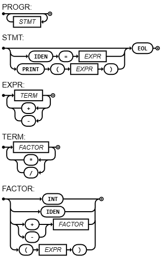

# log-comp

[](https://compiler-tester.insper-comp.com.br/svg/rafaela-alexandre/log-comp)

This repository is monitored by Compiler Tester for automatic compilation status.
## Diagrama Sintático


## EBNF
```ebnf
PROGRAM        = { FUNCDEC | STATEMENT } ;
FUNCDEC        = "function", IDENTIFIER, "(", [ IDENTIFIER, TYPE, { ",", IDENTIFIER, TYPE } ], ")", [ TYPE ], "\n", { STATEMENT }, "end" ;
BLOCK          = "do", "\n", { STATEMENT }, "end" ;
STATEMENT      = ( VARDEC
                 | IMUTDEC
                 | IDENTIFIER, ( "=", BOOLEXPRESSION | "(", [ BOOLEXPRESSION, { ",", BOOLEXPRESSION } ], ")" )
                 | ("if", BOOLEXPRESSION, "then", "\n", BLOCK, ["else", "\n", BLOCK], "end")
                 | ("print", "(", BOOLEXPRESSION, ")")
                 | ("while", BOOLEXPRESSION, "do", "\n", BLOCK, "end")
                 | ("for", IDENTIFIER, "=", EXPRESSION, ",", EXPRESSION, [",", EXPRESSION], "do", "\n", BLOCK, "end")
                 | ("repeat", "\n", BLOCK, "until", BOOLEXPRESSION)
                 | BLOCK
                 | "return", BOOLEXPRESSION
                 | Ε ), EOL ;
VARDEC         = "local", IDENTIFIER, TYPE, ["=", BOOLEXPRESSION] ;
IMUTDEC        = "imut", IDENTIFIER, "=", BOOLEXPRESSION ;
BOOLEXPRESSION = BOOLTERM, { "or", BOOLTERM } ;
BOOLTERM       = NOTEXPRESSION, { "and", NOTEXPRESSION } ;
NOTEXPRESSION  = ["not"], RELEXPRESSION ;
RELEXPRESSION  = CONCATEXPRESSION, [("<" | "==" | ">"), CONCATEXPRESSION] ;
CONCATEXPRESSION = EXPRESSION, ["..", CONCATEXPRESSION] ;
EXPRESSION     = TERM, { ("+" | "-"), TERM } ;
TERM           = FACTOR, { ("*" | "/"), FACTOR } ;
FACTOR         = ("+"|"-"), FACTOR | "(", TYPE, ")", FACTOR | "read", "(", ")" | POWER ;
POWER          = ATOM, ["**", FACTOR] ;
ATOM           = "(", BOOLEXPRESSION, ")"
               | INT | FLOAT | BOOL | STR
               | IDENTIFIER, [ "(", [ BOOLEXPRESSION, { ",", BOOLEXPRESSION } ], ")" ]
               | ("if", BOOLEXPRESSION, "then", BOOLEXPRESSION, "else", BOOLEXPRESSION, "end") ;
TYPE           = "number" | "string" | "boolean" | "float" ;
BOOL           = "true" | "false" ;
INT            = DIGIT, { DIGIT } ;
FLOAT          = DIGIT, { DIGIT }, ".", { DIGIT } ;
STR            = '"', { CHAR }, '"' ;
IDENTIFIER     = LETTER, { LETTER | DIGIT | "_" } ;
DIGIT          = 0 | 1 | ... | 9 ;
LETTER         = a | b | ... | z | A | B | ... | Z ;
```
